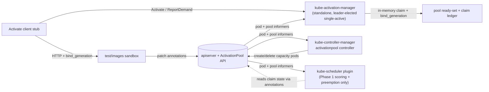

> ⚠️ **This is an automatically published [staged repository](https://git.k8s.io/kubernetes/staging#external-repository-staging-area) for Kubernetes**.   
> Contributions, including issues and pull requests, should be made to the main Kubernetes repository: [https://github.com/kubernetes/kubernetes](https://github.com/kubernetes/kubernetes).  
> This repository is read-only for importing, and not used for direct contributions.  
> See [CONTRIBUTING.md](./CONTRIBUTING.md) for more details.

# Activation

This repository contains the Activation gRPC contract (`Activate` / `ReportDemand`) used by
routers (e.g. EPP) to bind warm capacity from an `ActivationPool`.

The REST types for `ActivationPool` live in [`k8s.io/api/activation`](https://git.k8s.io/kubernetes/staging/src/k8s.io/api/activation).

## Architecture

## Community, discussion, contribution, and support

Activation is developed under [SIG Scheduling](https://github.com/kubernetes/community/tree/master/sig-scheduling).

You can reach the maintainers of this project at:

- Slack: [#sig-scheduling](https://kubernetes.slack.com/messages/sig-scheduling)
- Mailing List: [kubernetes-sig-scheduling](https://groups.google.com/forum/#!forum/kubernetes-sig-scheduling)

Learn how to engage with the Kubernetes community on the [community page](http://kubernetes.io/community/).

### Code of conduct

Participation in the Kubernetes community is governed by the [Kubernetes Code of Conduct](code-of-conduct.md).
