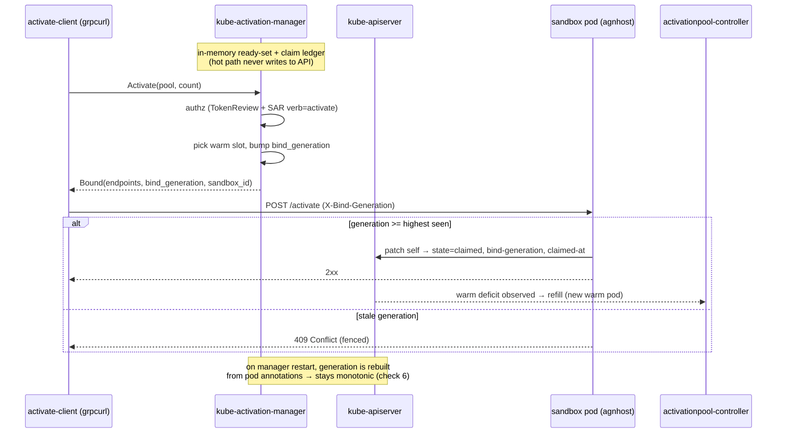
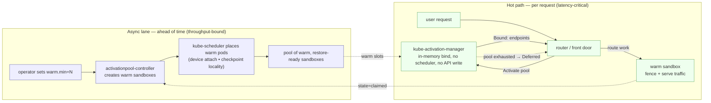

# Phase 0 activation PoC — demo flow

Visual companion to [`README.md`](./README.md) and [`run-demo.sh`](./run-demo.sh).
Two views: the demo run (setup + the six exit checks) and the data-plane path
those checks exercise.

## Demo run

```mermaid
flowchart TD
    subgraph SETUP[Setup]
        P0["Preflight: kubectl get --raw /apis/activation.k8s.io/v1alpha1<br/>(feature gate + runtime-config both on)"]
        P1["kubectl apply manifests.yaml<br/>ns • RBAC • PodTemplate • ActivationPool(demo)"]
        P2["KCM activationpool-controller<br/>reconciles warm deficit → creates N warm pods<br/>(agnhost activation-sandbox)"]
        P3["start kube-activation-manager<br/>(Activate gRPC server, :10269)"]
        P4["wait_warm: pods warm AND container Ready"]
        P0 --> P1 --> P2 --> P3 --> P4
    end

    P4 --> C1

    subgraph CHECKS[Phase 0 exit checks]
        C1["1. warm-hit<br/>activate-client → grpcurl Activate(count=1)"]
        C1R{{"Bound: endpoints + bind_generation=1 + sandbox_id"}}
        C1 --> C1R

        C2["2. SAR-deny<br/>deny-client → Activate"]
        C2R{{"authz TokenReview+SAR → PermissionDenied"}}
        C1R --> C2 --> C2R

        C3["3. miss<br/>activate-client → Activate(count=999, deadline 400ms)"]
        C3R{{"Deferred: DeadlineExceeded (no bind)"}}
        C2R --> C3 --> C3R

        C4["4. fence<br/>port-forward sandbox → POST /activate"]
        C4R{{"gen=N → 2xx (state=claimed)<br/>gen=N-1 → 409 Conflict"}}
        C3R --> C4 --> C4R

        C5["5. isolation<br/>burst 20× Activate"]
        C5R{{"scheduler_schedule_attempts_total unchanged<br/>(bind path bypasses scheduler)"}}
        C4R --> C5 --> C5R

        C6["6. durability<br/>kill + restart manager, Activate again"]
        C6R{{"bind_generation ≥ prior, monotonic<br/>(reconstructed from pod annotations)"}}
        C5R --> C6 --> C6R
    end

    C6R --> DONE["All Phase 0 exit checks passed"]
```

## Data-plane path (checks 1, 4, 6)

The write-free hot path, plus the sandbox's self-write on bind.

## Real-world use case: on-demand warm sandboxes

The demo is deliberately abstract (agnhost stands in for the runtime). Mapped to
a real system — a service that hands each request its own isolated, pre-warmed
sandbox (an AI-agent/code-exec sandbox, a GPU inference slot, a FaaS worker)
with sub-second start — the two lanes look like this:

The point: the **expensive** decision (where to place capacity) runs in the async
lane via the scheduler; the **latency-critical** decision (which warm slot to
hand this request) runs in the hot path with an in-memory bind. They are
decoupled — binding thousands of requests never touches `kube-scheduler`.

| Demo (PoC) | Real system |
|---|---|
| `ActivationPool` `warm.min/max` | Hot-pool size: your latency-vs-cost dial per sandbox profile |
| warm `agnhost` pod | Restore-ready sandbox (snapshot/CRIU/Firecracker, model preloaded) |
| `Activate` → `Bound` | Router's "give me a sandbox now" → endpoints to send traffic to |
| `Deferred / DeadlineExceeded` | Pool exhausted in time budget → caller fails fast / falls back |
| SAR `verb=activate` deny | Multi-tenant authz at the bind |
| `bind_generation` fence | Anti–split-brain when slots are reused or the manager restarts |
| `state=claimed` → refill | Replacement warmed the instant a slot is taken |
| scheduler counters flat | Bind throughput independent of scheduler load |

Still fake in Phase 0: the runtime itself (agnhost only fences + self-patches),
checkpoint-locality/preemption scoring (pending P1), device/GPU attach, quotas,
health/eviction, and HA of the claim ledger.

## Two things the diagrams make explicit

- **The hot path (Activate) never writes to the apiserver.** The manager answers
  from in-memory state; the only API write is the sandbox marking *itself*
  `claimed`, which is what lets the controller observe the deficit and refill.
  That decoupling is what check 5 (isolation) proves.
- **`bind_generation` is the fence.** It is monotonic per slot and reconstructed
  from pod annotations on manager restart, which is what checks 4 (fence) and
  6 (durability) lean on.
